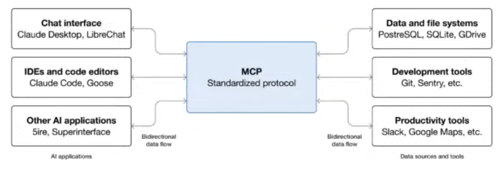
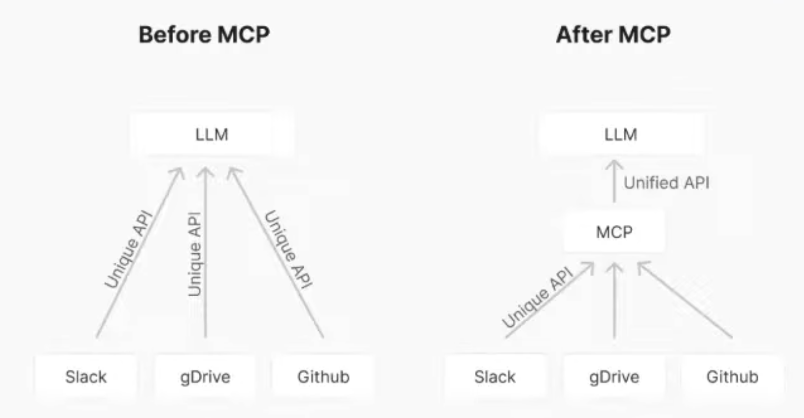
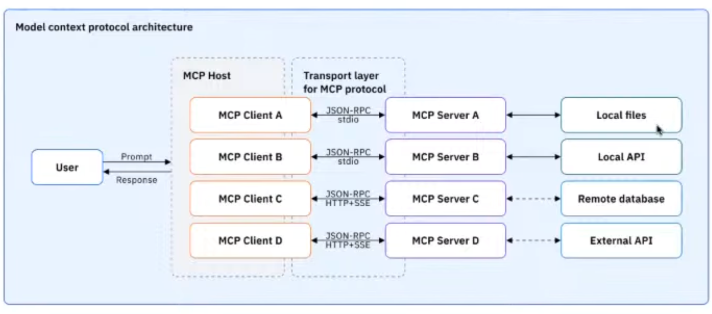

# Model Context Protocol (MCP)

## Introduction

### Definition
MLP is an open standard that enables developers to build 2-way connections between their data sources and AI-powered tools. Introduced by Antrophics.

Before MCP, people connect without standardized protocol.

### Architecture
- **MCP Host**: Where AI coordinates and manages MCP clients (Where MCP clients run)
- **MCP Client**: A component that maintain connections to an MCP server. Communition to MCP server done using JSON RPC
- **MCP Server**: Provides context to MCP clients, integrating to specific data or applications

### Primitives

| Type | Feature | Examples | Characteristic
| --- | --- | --- | --- | 
| Server | Tools | Send Messages, Search Flights | Perform an action |
| Server | Resources | Retrieve Documents| Return data |
| Server | Prompt | Summarize meetings| Return string prompt |
| Client | Sampling | Handing LLM calling to client | Allows servers to request language model completions through the client
| Client | Roots | Read Specific files | Expose file to server
| Client | Elicitation | Ask user details |  |
| Notifications |  | Notify progress |  Notify client |

### Communciation
Via JSON through 
- Stdio: happens in system process only ->  `mcp.run(transport="stdio")`

- Streamable HTTP: Send request and return response -> `mcp.run(transport="streamable-http")`
